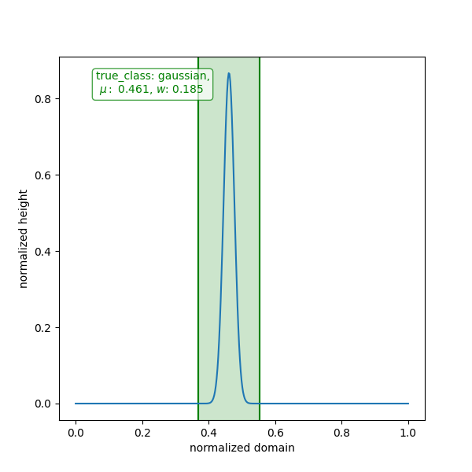
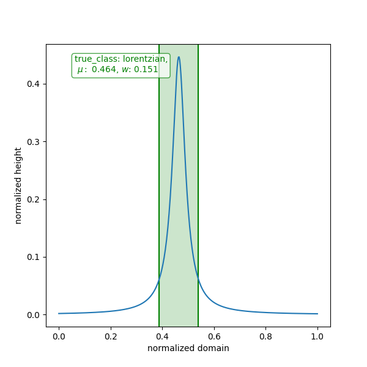
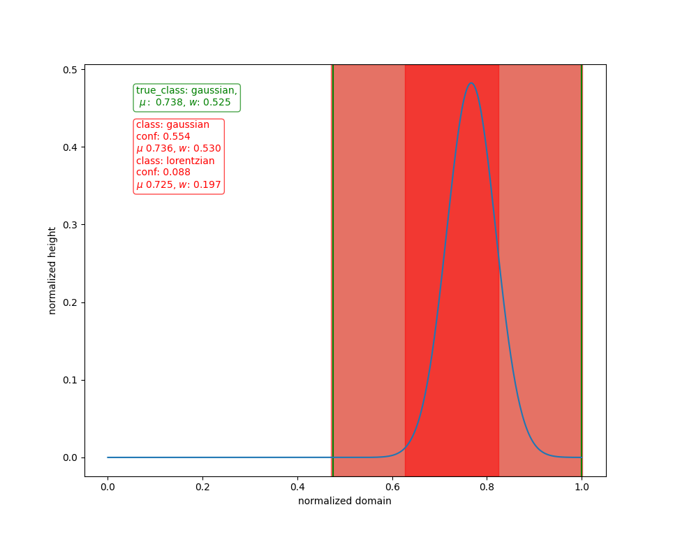
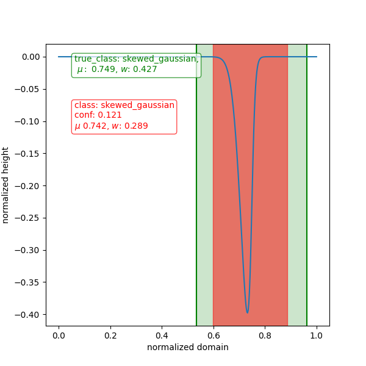

# YOLOv3 1D (PyTorch)
This is a minimum viable YOLOv3 Network for 1D event detection. The basic structure was inspired by Alladin Perssons `YOLOv3 From Scratch' tutorial but adjustments are made such the network handles 1D input vectors and the output detection creates bounding domains instead of bounding boxes.

This repository can essentially be seen as a fork of `https://github.com/aladdinpersson/Machine-Learning-Collection/tree/master/ML/Pytorch/object_detection/YOLOv3`. For this I have added the same license (MIT License).

## Data format
Data is stored in numpy arrays. Only fixed length inputs with sizes of multiples of 32 are supported. Each dataset is stored in a seperate file the `data/test_data/1d_series` directory. Labels are stored in `data/test_data/labels` directory as a csv with rows for each ground_truth bounding box/bounding domain. This follows the convention of image datasets used to train default (2D) Yolo networks. No doubt this could be improved but this repo makes minimal effort to implement this in a more efficient way.

Series data is stored as numpy arrays with shape `(n_channels, n_samples)` with `n_channels` the 1D analog of `RGB` channels, for my datasets I have simply set them to 1. This could, however, be interesting for multiphase data for instance. `n_samples` is the number of samples in one 1D dataset, and by default is equal to 416, and must be a multiple of 32.

Label data is stored in csv format with each row representing a ground truth label.
The first column represents the center of an ojbect, the second column the width, the third and final column the class label as an integer.

The test data used as validation of the network performance can be generated using the `generate_data.py` script. It is a very rudamentary script for generating some training data. It generates gaussian curves, skewed gaussian curves and lorentzian curves. The means and width of the various curves are randomly generated and the labels are correspondingly generated.

# Training
This repo includes a training script. In order to run the script first generate the training data and make sure that the config file is setup propperly. Then simply run `train.py`. During training the mean average precision (MAP) value of the network will be calculated on regular intervals. The closer this is to 1, the better the network performs. A checkpoint is saved after every epoch.

Currently a decent MAP score of 0.86 is reached. This could no doubt be improved by improving the data (labeling), network, training time and hyperparamteris, but this result was sufficient for this minimum viable example.

# Visualization of performance
To visualize the performance `visualize_performance.py` script is added. This script
plots some of the curves with ground truth labels in green and predicted domains in red. Some examples are shown below.

### Some examples of correct classifications:

Most classifications fall into this category

### Some examples of missed classifications:

A significant but smaller portion is never classified at all. This is the biggest
issue with the current state of the network on this dataset.

### An example of a double classification

A very small minority of cases has a double prediction

### An example of a bad bounding box classification

Only one example I personally saw had a bad bounding box prediction (width was significantly too small)

# Discussion
The current state of this repository implements a working 1D curve detector based on
the standard YOLOv3 architecture where 2D convolutions have been replaced with 1D convolutions. The output shape of the network has also correspondingly been changed such that 1D domains are predicted. Other than that no major changes have been made to the network architecture. When testing the network on a rudamentary dataset, an `mAP@50-95` of 0.86 was achieved, which was deemed good enough for this minimum viable example. This repository will not be developed further, but will hopefully be a nice stepping stone for anyone wanting to implement their own 1D YOLO network. The network was trained only for 30 epochs. More training did not seem to significantly improve
the mAP value.

Some issues with the performance on the given dataset are that objects are sometimes not observed. When observed however, the bounding box predictions are always very good. In some rare cases two classes are predicted for the same object, this may be due to inherrently similar data (gaussian, skew gaussian, lorentzian peaks) or perhaps due to some sub-optimal network hyperparameters. In general the confidence of many predictions is still fairly low.

Improvements in the networks architecture, bbox default anchors and perhaps better data (more classes, better labeling, especially for lorentzian peaks) could help improve the network's mAP value.
