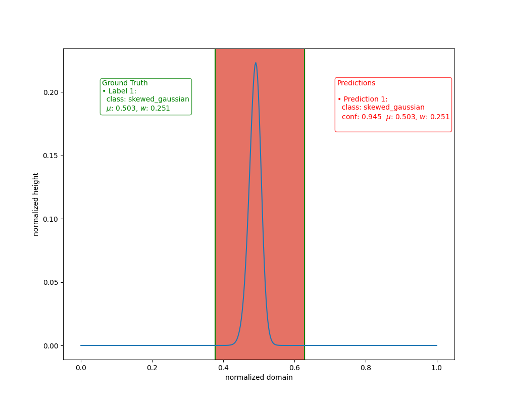

# YOLOv3 1D (PyTorch)
This is a minimum viable YOLOv3 Network for 1D event detection. The basic structure was inspired by Aladdin Perssons `YOLOv3 From Scratch' tutorial but adjustments are made such the network handles 1D input vectors and the output detection creates bounding domains instead of bounding boxes. Its purpose is to detect (low frequency) events such as gaussian peaks, sigmoid steps or similar curves in signals. Preliminary tests show great performance on these types of curves, even on similar curves like gaussian peaks, lorentzian peaks and skewed gaussian peaks. It has not been tested on high frequency data, on which perhaps 2D convolutions over the time-frequency domain of a signal may be a better approach.

**IMPORTANT NOTE**: *this repository was implemented "quick and dirty" as an exploratory project. It is, therefore, not amazingly interpretable without the video tutorial by Aladdin Persson. I highly advise anyone who wants to use or reimplement this repository to watch [his tutorial](https://www.youtube.com/watch?v=Grir6TZbc1M) on implementing the standard YOLOv3 network on YouTube.*

Although I have fully reimplemented the code base from scratch, this repository can essentially be seen as a fork of [this repository](https://github.com/aladdinpersson/Machine-Learning-Collection/tree/master/ML/Pytorch/object_detection/YOLOv3). For this reason, I have added the same (MIT) license.
## Dependencies
+ PyTorch: `torch`
+ other: `numpy`, `matplotlib`, `pandas`, `tqdm`

pip install command

```
pip install torch tqdm numpy matplotib pandas
```

## Data format
Data is stored in numpy arrays. Only fixed length inputs with sizes of multiples of `32` are supported. The default array length is `416`. The network has not been tested against higher data lengths so I'm not sure if it fails if you try to use those as inputs to the network, even though it theoretically should be able to handle them as the YOLO network is a fully-convolutional network. Each dataset is stored in a seperate file in the `data/test_data/1d_series` directory. Labels are stored in `data/test_data/labels` directory as a csv with rows for each ground_truth bounding box/bounding domain. This follows the convention of image datasets used to train default (2D) Yolo networks. There is no doubt this storage method could be improved (as this is a fairly inefficient way to store and load numpy arrays) but this repo makes minimal effort to implement this in a more efficient way.

Series data is stored as numpy arrays with shape `(n_channels, n_samples)` with `n_channels` the 1D analog of `RGB` channels, for my datasets I have simply set them to `n_channels=1`. Using multi-channel input could, however, be interesting for multiphase data for instance. `n_samples` is the number of samples in one 1D dataset, and by default is equal to 416, and must be a multiple of 32.

Label data is stored in csv format with each row representing a ground truth label.
The first column represents the center or mean of an object/event, the second column the width, the third and final column the class label as an integer (e.g. `gaussian=0, skew_gaussian=1, lorentzian=2`). The mean and width are normalized over the input domain (between 0 and 1).

The following label would assign two ground truth labels (one gaussian at to a signle dataset at x=0.23 with width 0.1 and a skew_gaussian at 0.54 with width 0.2).
```csv
#some_label.csv
0.23 0.1 0
0.54 0.2 1
```

A test dataset used as a benchmark of the network performance can be generated using the `generate_data.py` script. It is a very rudamentary script for generating some training and test data. It generates gaussian curves, skewed gaussian curves and lorentzian curves. The means and width of the various curves are randomly generated and the labels are correspondingly generated.

# Augmentations
Augmentations help stretch a dataset. I have implemented a basic augmentation module which (partly) follows the [albumentations](https://github.com/albumentations-team/albumentations) framework. Some basic augmentations are x-direction flipping, adding baselines (polynomial y-offset which may be present in real data), or translating the data. These augmentations may be randomized by using the included distributions. 

# Training
This repo includes a training script. In order to run the script first generate the training data and make sure that the config file is setup propperly. Then simply run `train.py`. During training the mean average precision (mAP) value of the network will be calculated on regular intervals. The closer this is to 1, the better the network performs. A checkpoint is saved after every epoch.

Currently an mAP score of 0.99 is reached on the test dataset, which is very good! Whether or not this has anything to do with overfitting is up for debate however.

# Visualization of performance
To visualize the performance `visualize_performance.py` script is added. This script
plots some of the curves with ground truth labels in green and predicted domains in red. Some examples are shown below. Note that ground truth colouring is generally hidden behind the red prediction labels due to good bounding domain fitting.

Most classifications fall into this category





# Discussion
The current state of this repository implements a working 1D curve detector based on
the standard YOLOv3 architecture where 2D convolutions have been replaced with 1D convolutions. The output shape of the network has also correspondingly been changed such that 1D domains are predicted. Other than that no major changes have been made to the network architecture. When testing the network on a rudamentary dataset, an `mAP@50-95` of 0.99 was achieved, which was deemed a great result for this minimum viable example. The current state of this repo should be a nice stepping stone for anyone wanting to implement their own 1D curve detector.
